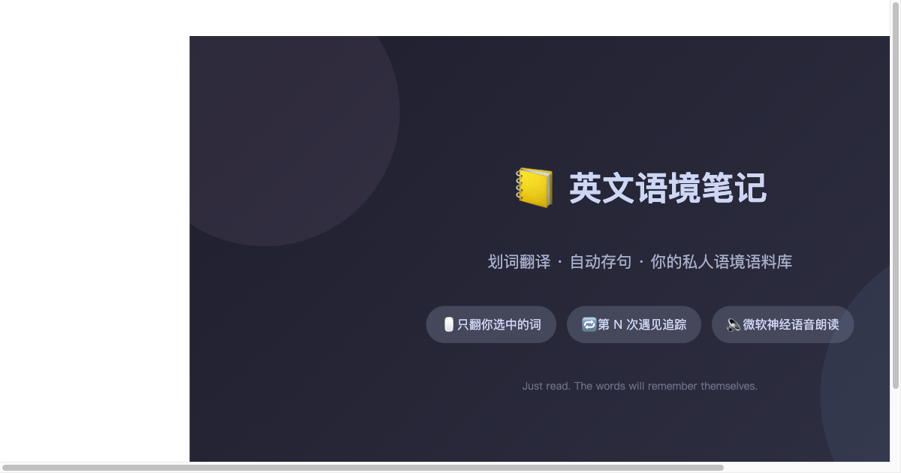
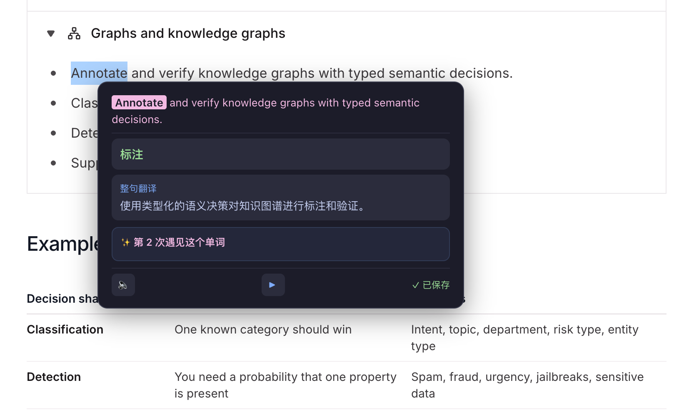
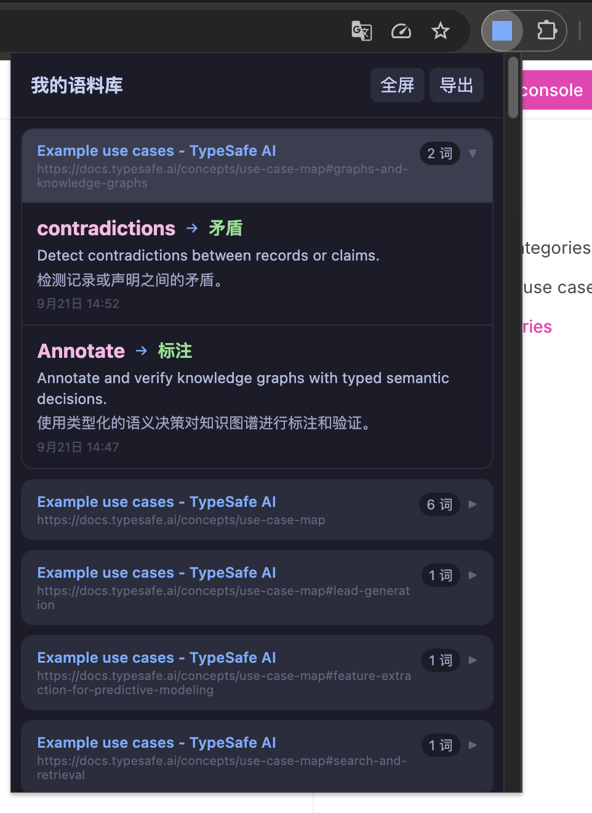

<p align="center">
  
</p>

<h1 align="center">英文语境笔记 · English Context Notes</h1>

<p align="center">
  <strong>划词翻译，自动存句。你的私人语境语料库。</strong><br>
  <em>Just read. The words will remember themselves.</em>
</p>

<p align="center">
  
  
  
  
  
</p>

<p align="center">
  <br>
  <sub>在读英文文章时划一个词：语境释义、整句翻译、遇见次数，一站到齐</sub>
</p>

<p align="center">
  <br>
  <sub>语料库自动按 日期 → 网站 → 单词 归档，你的每一次"遇见"都有出处</sub>
</p>

---

## 为什么做这个

市面上的翻译插件都在帮你「读懂页面」，但没有人在帮你「记住单词」。

**英文语境笔记**做的事情不一样：你在读技术文章、看新闻、刷 Reddit 时顺手划一个生词，它自动取整句、翻译、保存。下一次在另一篇文章里再遇到这个词时，弹窗告诉你「这是第 3 次遇见了」。你不刻意背，但一个词在不同语境里反复撞见，自然就记住了。

它不是翻译工具，是你的**语境语料库**。

---

## ✨ 特性

- **🖱 划词翻译（只动你选的词）** — 选中一个词，自动提取完整句子；AI 给出这个词在当前语境的含义 + 整句参考翻译，页面其他地方一个字不改，阅读理解仍是你自己完成
- **🔈 微软神经语音发音** — 单词有独立播放按钮，点击句子里的高亮词也能读；英文为美音女声（Aria），来自 Edge 浏览器同款在线语音，免费、无需任何 Key
- **▶ 整句朗读** — 原句一键朗读，播放中可随时停止，顺便练听感
- **🔁 遇见追踪** — 同一个词在不同文章里再次选中，自动标记「第 N 次遇见」，并显示之前在哪篇文章见过
- **🔥 频率分级** — 3 次高频 · 5 次熟悉 · 7 次已掌握（自动淡出）
- **📒 语料库** — 按日期 → 网址 → 单词三级组织，可搜索、可导出；附成长概览（累计单词、重复遇见率、日活热力图、高频词榜）
- **🔒 数据完全本地** — 所有记录存在浏览器 IndexedDB，不上传任何服务器

---

## 🚀 安装

### Chrome Web Store

> 🚧 即将上架，敬请期待

### 手动安装（开发者模式）

**方式一：下载 ZIP（不会 git 也能装）**

1. 点击本页绿色 `Code` 按钮 → `Download ZIP`，解压到任意目录

**方式二：git clone**

```bash
git clone https://github.com/MMJC6/en-context-notes.git
```

**然后加载：**

1. 打开 `chrome://extensions/`，开启右上角「开发者模式」
2. 点击「加载已解压的扩展程序」，选择解压/克隆出来的目录
3. 右键扩展图标 → 选项，填入你的 API Key，完成

> 更新：仓库有新版本时，重新拉取（或重新下载 ZIP 覆盖），再到 `chrome://extensions/` 点扩展卡片上的 🔄 刷新即可。

### 配置 API

支持所有 OpenAI 兼容接口。推荐 [DeepSeek](https://platform.deepseek.com/)（新用户有赠送额度，日常划词几乎花不到钱）。

配置来源优先级：**设置页 > env.js > 内置默认值**。`env.js` 从 `env.example.js` 复制而来，只在本地生效，适合预置私有网关地址或 Key，不会被提交到 git。

| 设置项 | 默认值 | 说明 |
|--------|--------|------|
| API Base URL | `https://api.deepseek.com/v1` | 任意 OpenAI 兼容接口 |
| Model | `deepseek-flash` | 旧名 `deepseek-chat` / `deepseek-v4-flash` 已退役，详见 [DeepSeek 模型说明](https://api-docs.deepseek.com/quick_start/pricing) |
| API Key | *需要你自己申请* | |

> 🔊 发音**不需要**任何 Key：使用微软 Edge 的免费在线朗读服务，安装即用；断网时自动回退系统语音。

---

## 🆚 和「全页翻译」插件的区别

| | 沉浸式翻译类 | 英文语境笔记 |
|---|---|---|
| 目标 | 帮你**读懂**这个页面 | 帮你**记住**这些单词 |
| 翻译范围 | 整页双语对照 | 只翻你选中的词（句子保持英文原貌） |
| 生词管理 | 无 | 自动记录：原句 + 来源网站 + 遇见次数 |
| 适合场景 | 硬着头皮读完再说 | 长期阅读、词汇自然增长 |

两者并不冲突——很多人全页翻译读资讯，读需要精读的文章时用划词攒语料。

---

## ❓ FAQ

**要花钱吗？**
插件免费开源（MIT）。翻译走你自己的 AI Key，DeepSeek 充几块钱日常划词能用很久；发音用的是微软 Edge 免费在线语音，不产生费用。

**我的数据存在哪？**
全部在本地浏览器的 IndexedDB 里，不上传任何服务器，卸载扩展即清除。

**支持哪些浏览器？**
Chrome（MV3）。Edge 理论兼容，未做专门适配；Firefox 需要改 manifest。

**没有网能用吗？**
翻译和发音需要联网。发音在断网时会自动回退到系统自带语音。

---

## 🗓 更新日志

**v1.1**（2026-09）

- 🔊 朗读升级为微软 Edge 神经网络语音（美音女声 Aria），替换系统机器音；断网自动回退
- 🔈 新增单词独立播放按钮；点击句中高亮词即可发音
- 🛠 修复「播放中点停止无效」的问题；播放状态可见（⏹）、播完自动复位
- 🤖 默认模型切换为 `deepseek-flash`（`deepseek-chat` 已退役）

**v1.0**（2026-08）

- 首个完整版本：划词翻译、遇见追踪、频率分级、语料库、成长概览

---

## 🗺 路线图

- [x] 划词翻译 + 自动取整句
- [x] AI 翻译（词+句）
- [x] 遇见追踪 + 频率分级
- [x] 语料库（按日期/网址分组）+ 成长概览
- [x] 微软神经语音朗读（单词 + 整句）
- [ ] Chrome Web Store 上架
- [ ] 导入/导出 Anki
- [ ] 云同步（Firebase）
- [ ] 手机 App（查看语料库）

---

## 🤝 反馈

用着顺手的话，欢迎点一个 ⭐ Star 让更多人看到；遇到问题或想提功能建议，请[开一个 Issue](https://github.com/MMJC6/en-context-notes/issues)——都会看。

---

## License

MIT
